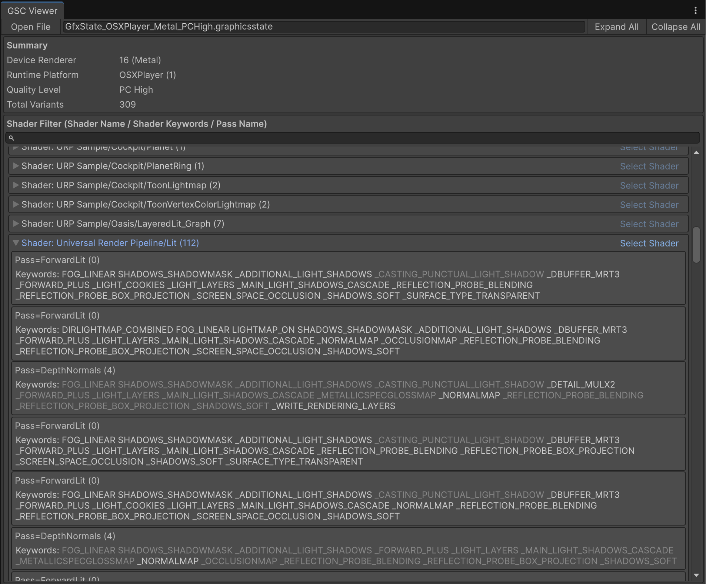
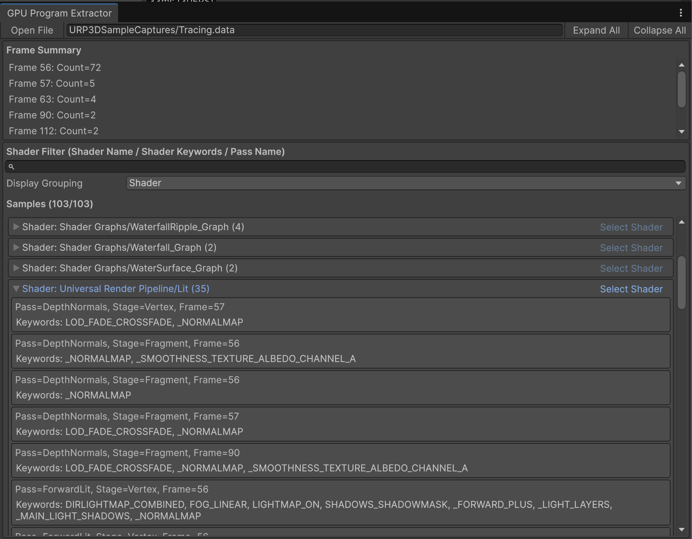

# GraphicsStateCollectionTools
Unity向けのGraphics State Collectionを解析・可視化するツールです。

## 概要
このパッケージは、次の 2 つのツールで構成されています。

- Graphics State Collection Viewer
	- GraphicsStateCollectionを読み取り、収集されたシェーダー、パス、キーワードを表示します。
- Shader.CreateGPUProgram Extractor
	- Profiler の `.data` ファイルから `Shader.CreateGPUProgram` を抽出し、どのシェーダーがどのフレームでコンパイルされたかを表示します。

他のプロジェクトで作成したGraphicsStateCollectionやProfilerデータを読み込むこともできます。

## 対応バージョン

- Unity 6000.0.0f1 以降

## インストール

Unity Package Managerで `Add package from git URL...`を選択し、以下のURLを入力してください。
```text
https://github.com/kazuyaraki/GraphicsStateCollectionTools.git?path=Packages/com.kazuyaraki.graphicsstatecollection-tools
```

または、`Packages/manifest.json` に直接以下を追加することもできます。

```json
{
  "dependencies": {
    "com.kazuyaraki.graphicsstatecollection-tools": "https://github.com/kazuyaraki/GraphicsStateCollectionTools.git?path=Packages/com.kazuyaraki.graphicsstatecollection-tools"
  }
}
```

## 使い方
### Graphics State Collection Viewer
`Window/Analysis/GSCTools/Graphics State Collection Viewer`を選択するとウィンドウが開きます。`Open File`から開くか、`.graphicsstate`ファイルをドラッグアンドドロップすることで解析を行います。



`Summary` にはプラットフォームやGraphics API などが表示されます。その下にShader一覧が表示され、`Shader Filter`にシェーダー名、パス名、キーワードを入力することでフィルタリングできます。

プロジェクト内に同名のシェーダーが存在する場合は`Select Shader`から選択でき、パス名も表示されます。また、パスを解析し、そのパスで使用していないシェーダーキーワードをグレーアウトします。GraphicsStateCollectionはシェーダー単位でキーワードを収集するため、他のパスに定義されているキーワードも含まれることがあり、パス単位で内容を確認する際の補助として利用できます。

ローカルにシェーダーが存在しない場合は、`Select Shader`は無効になり、パス解析に基づくキーワードのグレーアウトも行いません。

### Shader.CreateGPUProgram Extractor
`Window/Analysis/GSCTools/Shader.CreateGPUProgram Extractor` を選択するとウィンドウが開きます。`Open File` から開くか、Profiler の `.data` ファイルをドラッグアンドドロップすることで解析を行います。



`Frame Summary` にはシェーダーコンパイルが発生したフレームと件数が表示されます。その下に Shader 一覧が表示され、`Shader Filter` にシェーダー名、パス名、キーワードを入力することでフィルタリングできます。`Display Grouping` では Shader 単位または Frame 単位で一覧表示を切り替えられます。

プロジェクト内に同名のシェーダーが存在する場合は `Select Shader` から選択できます。ローカルにシェーダーが存在しない場合は `Select Shader` は無効になります。

## ライセンス
[Unlicense](https://unlicense.org/)